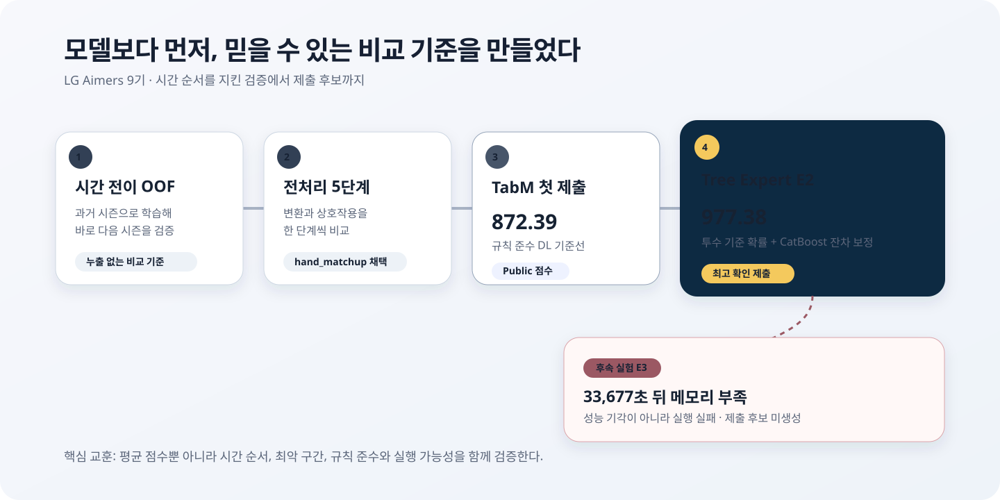

# LG Aimers 9기 프로젝트 요약

## 30초 요약

야구 투구 직전의 기록으로 제구 성공 확률을 예측한 프로젝트다. 미래 시즌을 예측하는
문제에 맞춰 무작위 분할 대신 과거 시즌으로 학습하고 다음 시즌을 검증했다. 전처리와
모델을 이 기준에서 비교한 결과, 첫 TabM 제출의 Public 점수 `872.3920184667`을
Tree Expert E2에서 **`977.3809532715`**까지 높였다.

최고 점수만 남기지 않았다. 좋아 보였지만 배포 조건에서 재현되지 않은 혼합 모델은
제출하지 않았고, 마지막 E3는 약 9시간 21분 실행 후 메모리 부족으로 끝났기 때문에
성능이 나빴다고 결론 내리지 않았다. 이 구분은 다음 실험을 고르는 기준이 됐다.

## 어떤 문제였나

목표는 각 투구가 의도한 위치에 들어갈 확률을 예측하는 것이었다. 단순히 성공과 실패를
맞히는 분류가 아니라 `0`과 `1` 사이의 확률을 제출한다. 그래서 확률과 실제 결과의
차이를 제곱해 평균한 **Brier 점수**를 로컬 검증 지표로 사용했다. Brier는 낮을수록
좋으며, DACON Public 점수는 대회가 이 성능을 별도 방식으로 환산한 값이라 높을수록
좋다.

대회 규칙상 한 평가 행의 예측은 다른 평가 행의 값이나 순서에 영향을 받으면 안 됐다.
평가 데이터 전체의 평균·빈도·순위, 행 사이의 누적 통계는 사용하지 않았다. 학습
데이터에서 미리 고정한 통계와 현재 투구 한 행의 정보만 추론에 사용했다.

## 어떻게 비교했나

모델보다 검증 방식을 먼저 고정했다. 2021년까지 학습해 2022년을 검증하고, 같은 방식으로
2022→2023, 2023→2024를 확인했다. 이를 **시간 전이 검증**이라고 한다. 실제로 과거
기록으로 미래 경기를 예측하는 상황과 비슷하고, 미래 시즌 정보가 학습에 섞이는 것을
막을 수 있다.

전처리도 한꺼번에 넣지 않았다. 수치 변환, 선수별 평활화, ID 빈도, 결측 표시와 같은 행
안의 상호작용을 다섯 단계로 나눠 비교했다. 이 과정에서 투수와 타자의 손잡이 조합인
`hand_matchup`을 포함한 구성을 채택했다.

## 점수가 바뀐 과정

| 제출 | Public 점수 | 판단 |
|---|---:|---|
| CatBoost 초기 기준선 | `828.9963889533` | 범주형 표 데이터의 출발점 |
| XGBoost 공격적 탐색 | `820.9583317093` | 현재 독립 예측 원칙과 맞지 않는 후처리 때문에 격리 |
| TabM + `hand_matchup` | `872.3920184667` | 전처리 비교를 통과한 첫 딥러닝 제출 |
| Tree Expert E2 | **`977.3809532715`** | 최고 확인 제출 |

Tree Expert E2는 과거 투수 기록으로 만든 성공 확률을 **anchor**, 즉 출발점으로 사용했다.
CatBoost는 정답 전체를 처음부터 다시 맞히는 대신 anchor가 남긴 오차를 학습했다. 이를
**잔차 보정**이라고 한다. 서로 다른 난수 시작값으로 학습한 CatBoost 세 개를 평균했고,
세 시간 구간과 245,789개 검증 행의 순서·배치 독립성 검사를 통과했다. TabM은 이 모델의
anchor가 아니라 개선 여부를 확인하는 비교 기준이었다.

## 채택하지 않은 결과도 남긴 이유

TabM 70%와 CatBoost 30% 혼합은 OOF에서 좋아졌지만 실제 배포와 같은 조건으로 다시
맞추자 모든 시간 구간을 통과하지 못했다. 최근 시즌에 가중치를 둔 T3, 계층 보정,
XGBoost·LightGBM 잔차 모델도 사전에 정한 조건을 넘지 못했다. 이런 결과는 `rejected`,
즉 실행은 유효하지만 성능 기준을 통과하지 못한 후보로 기록했다.

E3는 다르다. 전체 OOF 작업 63개 중 53개를 마친 뒤 `33,677.4초` 시점에 메모리 부족으로
종료됐다. 최종 판단, 전체 학습과 독립성 감사까지 가지 못했으므로 `failed`, 즉 실행
실패로 기록했다. 부분 결과만으로 모델 구조의 성능을 평가하지 않았다.

## 내가 직접 한 일과 Codex의 지원

나는 실험 방향을 확인하고 Kaggle·Colab에서 전체 데이터 학습을 실행했다. 실행 로그와
결과 파일을 보관해 다음 판단에 사용했고, 실제 제출 파일과 Public 점수를 확인했다.
후보를 계속 진행할지, 중단할지, 제출할지는 설명과 결과를 확인한 뒤 직접 결정했다.

Codex는 실험 코드 작성, 재개 가능한 실행 구조, 정적 검사, 대회 규칙 점검과 결과 정리를
보조했다. 내가 모든 기술 검사를 따로 재계산하거나 전체 모델 코드를 혼자 작성한 것은
아니다. 포트폴리오에서도 이 경계를 그대로 밝힌다.

## 다음 프로젝트에서 바꿀 점

- 긴 실험을 시작하기 전에 가장 큰 작업 하나로 시간과 최대 메모리를 측정한다.
- 전체 작업과 검사가 실행 제한의 70~80% 안에 끝날 때만 본 실행을 시작한다.
- 평균 성능뿐 아니라 가장 약한 시즌과 seed 편차를 함께 본다.
- 성능 기각과 환경·자원 실패를 다른 상태로 기록한다.
- 제출 점수로 가중치를 다시 맞추지 않고 시간 전이 OOF에서 결정을 끝낸다.

## 더 자세히 보기

- [프로젝트 전체 회고](PROJECT_RETROSPECTIVE.md)
- [실험 장부](../reports/EXPERIMENT_LEDGER.md)
- [기계 판독용 실험 기록](../reports/experiment_registry.json)
- [검증 설계 글](https://yonghyun-blog.vercel.app/blog/lg-aimers-9th-competition/2026-09-02-temporal-oof-validation/)
- [모델 개선 글](https://yonghyun-blog.vercel.app/blog/lg-aimers-9th-competition/2026-09-02-tabm-to-tree-expert-e2/)
- [OOM 운영 회고](https://yonghyun-blog.vercel.app/blog/lg-aimers-9th-competition/2026-09-02-ml-experiment-oom-retrospective/)
